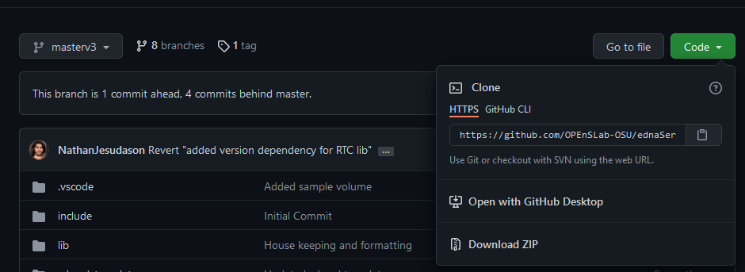

# **Firmware Installation**

----

<details open markdown="block">
  <summary>
    Table of contents
  </summary>
  {: .text-delta }
1. TOC
{:toc}
</details>

## Non-Git Method (recommended for non-programmers)

### Required Toolings

1. Install VSCode
2. Install PlatformIO extension `platformio.platformio-ide`

### Download ZIP Files from GitHub

1. Get the GitHub repository branch link that is relavent to your version in the<a href="https://docs.google.com/document/d/1sNdii0bUCyOve2XvNgGPh8UOBXxFWxznv6qSIyuU9vA"> Sampler History Document</a> under `Firmware`.

2. Download a ZIP file for that branch of code that you plan on using, and then unzip. 
  
    <div align="center">
        
    </div>

3. Download the ZIP file for the<a href="https://github.com/OPEnSLab-OSU/OPEnSamplerFramework/tree/develop"> Git Submodule</a> of the code. After unzipping this file, copy and paste the contents of the main folder inside of the `lib/Framework` folder from the download of step 2.

4. Open the code from step 2 inside of VSCode by going to `File => Open Folder...`

5. Next, click on `platformio.ini` configuration file located in the file explorer.

    <div align="center">
        
    </div>

6. Next, please comment the `[env:debug]` section and uncomment `[env:live]`. The file should look like the following. Notice that we have `;` in front of the commented line.

    ```bash
    ;[env:debug]
    ; build_type = debug
    ;build_unflags = -std=gnu++11
    ;build_flags = -D DEBUG=1 -Wall -Wno-unknown-pragmas -std=c++14

    ; [env:release]
    ; build_unflags = -std=gnu++11
    ; build_flags = -D RELEASE=1 -Wall -Wno-unknown-pragmas -std=c++14

    [env:live]
    build_unflags = -std=gnu++11
    build_flags = -D LIVE=1 -Wall -Wno-unknown-pragmas -std=c++14
    ```

7. `optional` Optionally you can change the server name and password by going to `src/configuration.hpp`. Otherwise, the server will default to the following values:

    ```c++
    #define SERVER_NAME     "ednaServer"
    #define SERVER_PASSWORD "password"
    ```

8. We are now ready to upload the firmware to the micro-controller. After connecting the micro-controller to your computer, please click on the `right-arrow` button located at the bottom of the status bar.
   <div align="center">
        
    </div>

## Git Method (recommended for development or users with programming experience)

### Required Toolings

1. Install VSCode
2. Install PlatformIO extension `platformio.platformio-ide`
3. Install Git

### Clone Git Repository

1. The following code clone development git repo to your local computer

    ```bash
    git clone https://github.com/OPEnSLab-OSU/ednaServer 
    cd ednaServer
    ```

2. Initialize git submodule. This will pull in another git repo that the server relies on.

   ```bash
    git submodule init
    git submodule update
    git submodule foreach "git checkout develop"
    code .
   ```

3. You should now have VSCode opened automatically. Next, click on `platformio.ini` configuration file located in the file explorer.

    <div align="center">
        
    </div>

4. Next, please comment the `[env:debug]` section and uncomment `[env:live]`. The file should look like the following. Notice that we have `;` in front of the commented line.

    ```bash
    ;[env:debug]
    ; build_type = debug
    ;build_unflags = -std=gnu++11
    ;build_flags = -D DEBUG=1 -Wall -Wno-unknown-pragmas -std=c++14

    ; [env:release]
    ; build_unflags = -std=gnu++11
    ; build_flags = -D RELEASE=1 -Wall -Wno-unknown-pragmas -std=c++14

    [env:live]
    build_unflags = -std=gnu++11
    build_flags = -D LIVE=1 -Wall -Wno-unknown-pragmas -std=c++14
    ```

5. `optional` Optionally you can change the server name and password by going to `src/configuration.hpp`. Otherwise, the server will default to the following values:

    ```c++
    #define SERVER_NAME     "ednaServer"
    #define SERVER_PASSWORD "password"
    ```

6. We are now ready to upload the firmware to the micro-controller. Please click on the `right-arrow` button located at the bottom of the status bar.
   <div align="center">
        
    </div>
