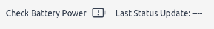

## Initial steps

The first thing to do with the UI is set the RTC of the sampler, which can be found under utilities. This should be done anytime there is a timezone change as well.

Remember that to get updates on status and sensor data to be on the monitoring tab. The top right corner keeps track of the last status update, as well as whether the battery is running low or not.

