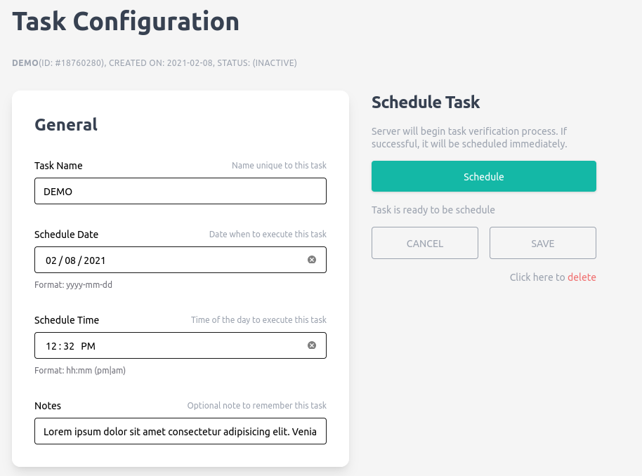
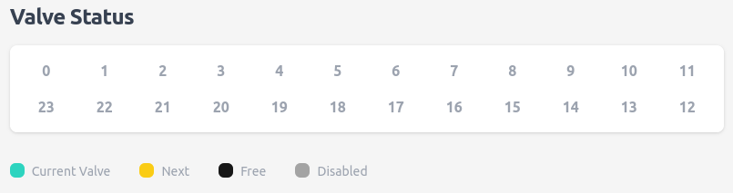
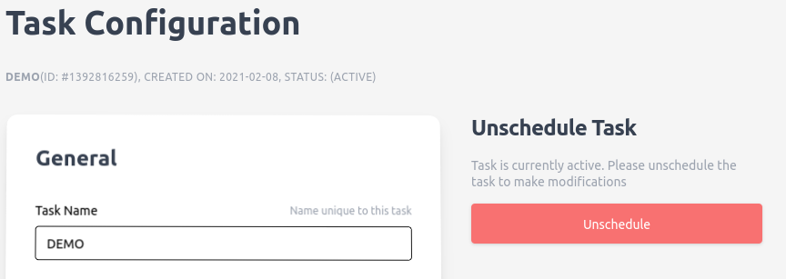

# **Task configuration**

----

  

    Table of contents
  

  {: .text-delta }
1. TOC
{:toc}

## Overview

To schedule a task, first select the `task` button on the left sidebar navigation tab. Here, the tasks are divided into `active` and `inactive` sections. The `active` tasks represents all the tasks currently scheduled for sampling.

    

## Create a new task

New task can be created by clicking on the button on the top. Next, enter the name you would like to identify the task. Please note that the name must be unique from other tasks in the system. Next, click the `OK` button (or press `enter`) to submit to task name for verification. If there is no conflict, a new task will be populated under `inactive` section.

    

## Rescheduling and modifying tasks

If you want to rerun a task you can schedule an inactive task (If changes are made you'll have to save the task first).

 
    

 After a task runs, the assigned valves become greyed-out. Under the utilities tab, use "reset valves" if you want to use a valve again.

 
    

If you want to make changes to a scheduled task, you have to unschedule it first.

    

## Detail description for task parameters

Most values are example values, though for the dry and preserve states there are recommended values.

### General

| Field         | Description                     | Notes                    |
| ------------- | ------------------------------- | ------------------------ |
| Name          | Name of the task                | This name must be unique |
| Schedule Date | The schedule calendar date      | *                        |
| Schedule Time | The time on the day of schedule | *                        |
| Notes         | A memo for future reference     | <= 127 characters        |

**NOTE**

* It is recommended to use either Firefox or Chrome as they comes built-in with date picker

### Valves

| Field        | Description                                               | Notes                                                                                                  |
| ------------ | --------------------------------------------------------- | ------------------------------------------------------------------------------------------------------ |
| Valves       | Valves assigned to this task                              | Comma-separated list of valve IDs                                                                      |
| Time Between | Amount of delay in seconds before sampling the next valve | The countdown starts after the machine perform all stages including flushing, cleaning, and preserving. |

### Flush

| Field      | Description   | Notes    | Example Value  |
| ---------- | ------------- | -------- | -------- |
| Flush Time | Time to flush | `Second` | 60 |

### Sample

Sample state is considered completed if any one of the below conditions is met.

| Field           | Description              | Notes    | Example values |
| --------------- | ------------------------ | -------- | ------------------ |
| Sample Time     | Max sample time duration | `Second` | 90       |
| Sample Volume   | Max sample volume        | `Liter`  | 0.5      |
| Sample Pressure | Max sample pressure      | `PSI`    | 25      |

**NOTE**

* The motor intakes about 350ml/min, so set the sample time and sample volume accordingly. If the time is too low, the sampling will stop before it reaches the volume.

### Dry

Dry state is a necessary part of the sampling routine to minimize the amount of water in the filter housing after sample

| Field    | Description                | Notes    | Recommended Value  |
| -------- | -------------------------- | -------- | -------- |
| Dry Time | Time duration in dry state | `Second` | 15 |

### Preserve

| Field         | Description                     | Notes    | Recommended Value  |
| ------------- | ------------------------------- | -------- | -------- |
| Preserve Time | Time duration in preserve state | `Second` |  15 |