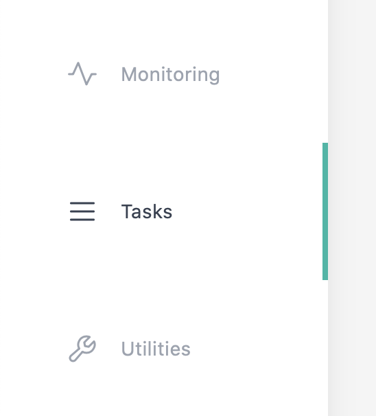

# **Task configuration**

----

To schedule a task, first select the `task` button on the left sidebar navigation tab. Here, the tasks are divided into `active` and `inactive` sections. The `active` tasks represents all the tasks currently scheduled for sampling.

    

## Create a new task

New task can be created by clicking on the button on the top. Next, enter the name you would like to identify the task. Please note that the name must be unique from other tasks in the system. Next, click the `OK` button (or press `enter`) to submit to task name for verification. If there is no conflict, a new task will be populated under `inactive` section.

    

## Detail description for task parameters

### General

| Field         | Description                     | Notes                    |
| ------------- | ------------------------------- | ------------------------ |
| Name          | Name of the task                | This name must be unique |
| Schedule Date | The schedule calendar date      | *                        |
| Schedule Time | The time on the day of schedule | *                        |
| Notes         | A memo for future reference     | <= 127 characters        |

**NOTE**

* It is recommended to use either Firefox or Chrome as they comes built-in with date picker

### Valves

| Field        | Description                                               | Notes                                                                                                  |
| ------------ | --------------------------------------------------------- | ------------------------------------------------------------------------------------------------------ |
| Valves       | Valves assigned to this task                              | Comma-separated list of valve IDs                                                                      |
| Time Between | Amount of delay in seconds before sampling the next valve | The countdown starts after the machine perform all stages including flushing, cleaning, and preserving |

### Flush

| Field      | Description   | Notes    | Example  |
| ---------- | ------------- | -------- | -------- |
| Flush Time | Time to flush | `Second` | `IRD` 10 |

**NOTE**

* `IRD` stands for "It Really Depends" but the usual values are given to right.

### Sample

Sample state is considered completed if any one of the below conditions is met.

| Field           | Description              | Notes    | Recommended values |
| --------------- | ------------------------ | -------- | ------------------ |
| Sample Time     | Max sample time duration | `Second` | `IRD` 30 ~ X       |
| Sample Volume   | Max sample volume        | `Liter`  | `IRD` 0.5 ~ X      |
| Sample Pressure | Max sample pressure      | `PSI`    | `IRD`  15 ~ X      |

**NOTE**

* `IRD` stands for "It Really Depends" but the usual values are given to right.

* The motor intakes about 350ml/min, so set the sample time and sample volume accordingly. If the time is too low, the sampling will stop before it reaches the volume.

### Dry

Dry state is a necessary part of the sampling routine to minimize the amount of water in the filter housing after sample

| Field    | Description                | Notes    | Example  |
| -------- | -------------------------- | -------- | -------- |
| Dry Time | Time duration in dry state | `Second` | `IRD` 10 |

**NOTE**

* `IRD` stands for "It Really Depends" but the usual values are given to right.

### Preserve

| Field         | Description                     | Notes    | Example  |
| ------------- | ------------------------------- | -------- | -------- |
| Preserve Time | Time duration in preserve state | `Second` | `IRD` 10 |

**NOTE**

* `IRD` stands for "It Really Depends" but the usual values are given to right.
