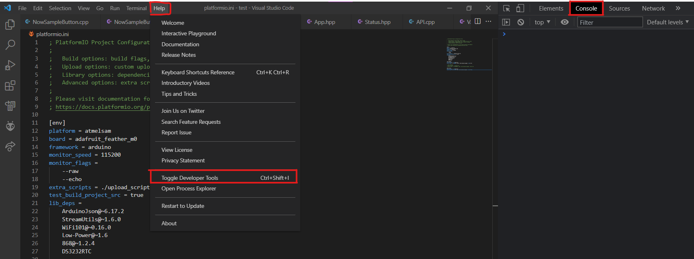

# **Trouble Shooting**

----

  

    Documented Problems
  

  {: .text-delta }
1. TOC
{:toc}

## SD file corruption

- What causes this?

It's possible that if power is interrupted to the sampler while it is writing to a SD file, meaning that file won't be written to properly. 

- What does this problem look like?

If the sampler doesn't work on start up and seems to freeze (lights aren't blinking, UI can't be connected to), then it is possible that this problem is occurring

- How to resolve this issue?

The easiest way to resolve this issue is to remove all files from the SD card and then put on new files. You may also run the sampler through debug mode following the firmware installation guide, and then check the serial monitor for when the sampler says there is an error.

## UI redirecting to https (Firefox)
- What causes this?

By default, Firefox attempts to connect websites using the HTTPS protocol, which is not supported by the eDNA sampler.

- What does this problem look like?

When trying to connect to `192.168.1.1`, you are automatically redirected to `https://192.168.1.1`, and can't connect to the UI

- How to resolve this issue?

Go to `about:config` (same as entering any web address), then search for `network.stricttransportsecurity.preloadlist` and make it set to false. Then, search for `browser.fixup.fallback-to-https` and set to false as well.

## PlatformIO (Visual Studio Code Extension) is not working
- What causes this?

There could be a variety of issues that is causing this.

- What does this problem look like?

There are a variety of possible error messages, but they all orignate from PlatformIO. For example: when trying to upload code, PlatformIO may complain that it cannot start its home server, or it may give an error message that it failed to install PlatformIO IDE.

- How to resolve this issue?

Often, the best thing to do is to open the Visual Studio Code Console and see what errors it prints. First, go to the `help` tab on the top menu of VSCode. Then, press `Toggle Developer Tools`. This will open a new panel on the right side of your screen, and you'll want to go the top menu on this panel and click on `Console`. Reading through some of error messages will tell you what the error is. For example, it could be that there's a missing python package. Because there's a variety of possible issues, if you feel uncomfortable solving them yourself, feel free to reach out to us and we can help.

    

